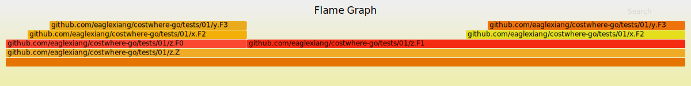

# costwhere

自定义打点的耗时统计工具，并将结果以火焰图的形式输出。

## install

> 火焰图生成工具目前只支持 Linux 环境

依赖安装

```bash
yay -S flamegraph # archlinux

```

> 或者直接下载 [flamegraph.pl](depts/flamegraph.pl) 到同目录

工具安装

```bash
go install github.com/eaglexiang/costwhere-go/cmd/costwhere

```

包引用

```go
go get github.com/eaglexiang/costwhere-go
// 或
// go get git.eaglexiang.org/eagle/costwhere

```

代码引用

```go
import costwhere "github.com/eaglexiang/costwhere-go"
// import costwhere "git.eaglexiang.org/eagle/costwhere"

func main() {
	ctx := context.Background()

	// 初始化并回收 costwhere 采集
	ctx, cw := costwhere.Init(ctx)
	defer func() {
		stacks, err := cw.EndWithJSON() // 以 JSON 格式对采集结果进行输出
		if err != nil {
			log.Printf("%+v", err)
			return
		}

		err = os.WriteFile("costwhere.json", stacks, 0644) // 将采集结果保存到文件（或输出到日志）
		if err != nil {
			log.Printf("%+v", err)
		}
	}()

	F(ctx)
}

func F(ctx context.Context) {
	defer costwhere.Mark(ctx)() // 在任何需要进行耗时统计的地方复制粘贴此代码

	time.Sleep(100 * time.Millisecond)
}

```

## use

```bash
costwhere -if="./data.json" -of="./flamegraph.svg"
# output flamegraph.svg

```

## output

